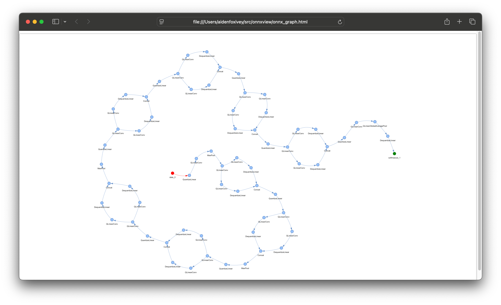

Install with `uv` or any other preferred python tool. Sync the requirements, run `main.py <onnx-file-path>`.

Run `open onnx_graph.html` if you're on a Mac!

- A photo of auto_Opset16.onnx being rendered in my browser.

- A screenshot of the much smaller squeezenet being rendered in my browser.